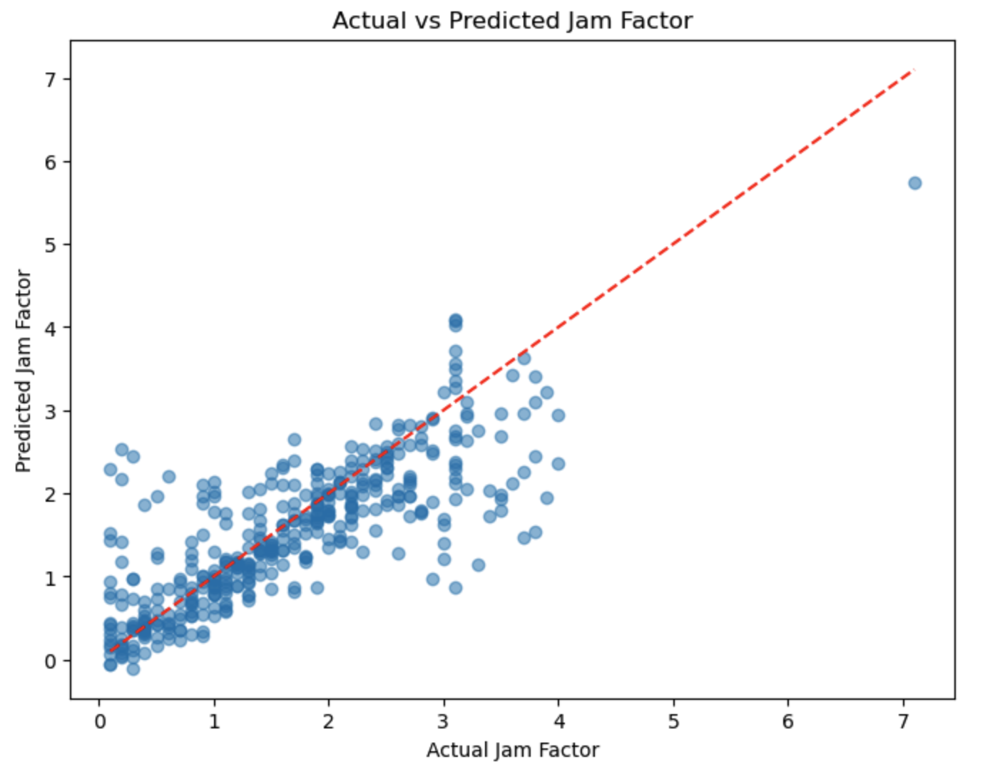
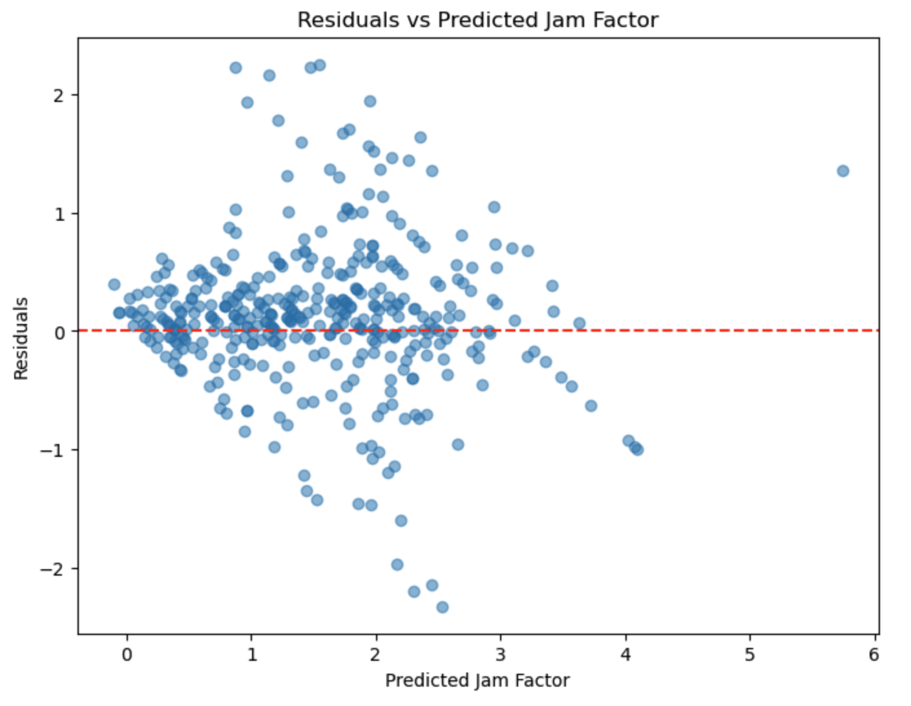

# Traffic Jam Factor Prediction System

A neural network-based system to predict traffic congestion (`jamFactor`) using weather, time, and street data. This project merges JSON files containing historical traffic and weather data, trains a neural network, and allows predictions for specific conditions.

---

## Table of Contents
1. [Project Overview](#project-overview)
2. [Installation](#installation)
3. [Data Preparation](#data-preparation)
4. [Model Architecture](#model-architecture)
5. [Training the Model](#training-the-model)
6. [Making Predictions](#making-predictions)
7. [Evaluation Metrics](#evaluation-metrics)
---

## Project Overview

### Objective
Predict the `jamFactor` (a metric indicating traffic congestion severity) using:
- **Day Type**: Weekday or weekend.
- **Time**: 09:00, 12:00, 15:00, 18:00, or 21:00.
- **Street**: Street name (e.g., `Feldkirchenstraße`).
- **Temperature**: Real-time temperature (°C).
- **Speed**: Average vehicle speed (km/h).

### Workflow
1. **Data Merging**: Combine multiple JSON files into a structured dataset.
2. **Preprocessing**: Encode categorical features and scale numerical data.
3. **Model Training**: Train a neural network to predict `jamFactor`.
4. **Prediction**: Use the trained model to predict congestion for new inputs.
5. **Evaluation**: Quantify model performance using regression metrics.

---

## Installation

### Prerequisites
- Python 3.8+
- pip package manager

### Steps
1. Clone the repository:
   ```bash
   git clone https://github.com/your-username/traffic-jam-predictor.git
   cd traffic-jam-predictor
   ```

2. Install dependencies:
   ```bash
   pip install -r numpy
   pip install -r pandas
   pip install -r sckit-learn
   pip install -r tensorflow
   pip install -r joblib
   ```
   *(requirements includes: `numpy`, `pandas`, `scikit-learn`, `tensorflow`, `joblib`)*

3. Ensure the following files are present:
   - [merged_output.json](https://github.com/pritom169/UniBam-MOBI-Project/blob/dev-pritom/%5B07%5D-traffic-and-weather-data/%5B02%5D-merged-data/merged_output.json): Merged traffic/weather data (generated from raw JSON files). It can
   - [train-and-test.ipnyb](https://github.com/pritom169/UniBam-MOBI-Project/blob/dev-pritom/%5B01%5D-codes/train-and-test.ipynb): Script to train the neural network and also for testing

---

## Data Preparation

### 1. Merging JSON Files
Raw JSON files are merged into `merged_output.json`, which structures data as:
```json
[
  {
    "street_name": "Brennerstraße",
    "number_of_nearby_pois": 6,
    "traffic": {
      "weekdays": {
        "09": [ ... ],
        "12": [ ... ],
        ...
      },
      "weekends": { ... }
    }
  },
  ...
]
```

### 2. Preprocessing
- **Categorical Encoding**:
  - **Street Names**: Label-encoded (e.g., `Feldkirchenstraße` → `0`, `Brennerstraße` → `1`).
  - **Time Slots**: One-hot encoded (e.g., `09` → `[1, 0, 0, 0, 0]`).
  - **Day Type**: Binary-encoded (`weekdays` → `0`, `weekends` → `1`).

- **Numerical Scaling**:
  - `temperature` and `speed` are standardized using `StandardScaler`.

### 3. Feature Combination
Features are combined into a single input matrix:
```
[ Street_OneHot | Day_Type | Time_OneHot | Scaled_Temperature | Scaled_Speed ]
```

---

## Model Architecture

### Neural Network Design
```python
Sequential(
  InputLayer(input_shape=(input_size,)),
  Dense(64, activation='relu'),  # Hidden Layer 1
  Dense(32, activation='relu'),  # Hidden Layer 2
  Dense(1)                       # Output Layer (Regression)
)
```
- **Activation**: ReLU for hidden layers (non-linearity).
- **Loss Function**: Mean Squared Error (MSE).
- **Optimizer**: Adam (learning rate = 0.001).

Here is a visual representation of the model
```
Input Layer (Features)
       |
       v
+-------------------+
| Hidden Layer 1    |
| 64 neurons, ReLU  |
+-------------------+
       |
       v
+-------------------+
| Hidden Layer 2    |
| 32 neurons, ReLU  |
+-------------------+
       |
       v
+-------------------+
| Output Layer      |
| 1 neuron, Linear  |
+-------------------+
       |
       v
Predicted jamFactor

---
```

## Training the Model

### Steps
1. Run the training script:
   ```bash
   python train_model.py
   ```

2. **Output**:
   - Trained model: `jam_factor_predictor.keras`
   - Preprocessing tools: `street_encoder.joblib`, `time_encoder.joblib`, `scaler.joblib`

### Training Process
- **Epochs**: 50
- **Batch Size**: 32
- **Validation Split**: 20% of training data
- **Metrics Tracked**:
  - Training Loss (MSE)
  - Validation Loss (MSE)
  - Mean Absolute Error (MAE)

---

## Making Predictions

### Using the `train-and-test.ipnyb` Script
```python
from predict import predict_jam_factor

# Example Input
jam_factor = predict_jam_factor(
    day_type='weekends',
    time='09',
    street='Feldkirchenstraße',
    temperature=5.0,
    speed=10.0
)
print(f"Predicted Jam Factor: {jam_factor:.2f}")
```

### Prediction Workflow
1. **Encode Street**: Convert street name to one-hot vector.
2. **Encode Day Type**: Convert to `0` (weekday) or `1` (weekend).
3. **Encode Time**: Convert time slot to one-hot vector.
4. **Scale Features**: Normalize `temperature` and `speed`.
5. **Predict**: Feed combined features to the neural network.

---

## Evaluation Metrics

### Metrics
1. **Mean Absolute Error (MAE)**: 
   ```python
   mae = mean_absolute_error(y_true, y_pred)
   ```
2. **Mean Squared Error (MSE)**:
   ```python
   mse = mean_squared_error(y_true, y_pred)
   ```
3. **Root Mean Squared Error (RMSE)**:
   ```python
   rmse = np.sqrt(mse)
   ```

### Visualization
1. **Actual vs Predicted Plot**:
   ```python
   plt.scatter(y_test, y_pred)
   plt.plot([min_val, max_val], [min_val, max_val], 'r--')
   ```
   
2. **Residual Plot**:
   ```python
   plt.scatter(y_pred, residuals)
   plt.axhline(0, color='red')
   ```
   
---