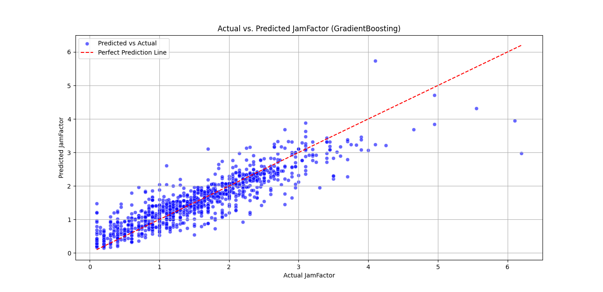

# Modelling Traffic Patterns in Bamberg

This project implements three approaches to predict traffic congestion (jamFactor) using shared core data: 
historical weather, time, street data, and points of interest (POI) from JSON files. A linear regression model 
provides baseline predictions, a neural network leverages deep learning for complex pattern recognition, and 
the ensemble method (RandomForest, XGBoost, GradientBoosting) enhances the independence of the predictions by 
leveraging different input features. All systems utilize the same foundational datasets.


## Table of Contents
1. [Project Overview](#project-overview)
2. [Installation](#installation)
3. [Data Preparation](#data-preparation)
4. [Model Architecture](#model-architecture)
5. [Training the Model](#training-the-model)
6. [Making Predictions](#making-predictions)
7. [Evaluation Metrics](#evaluation-metrics)
---

## Project Overview

### Objective
Predict the `jamFactor` (a metric indicating traffic congestion severity) using:
- **Day Type**: Weekday or weekend.
- **Time**: 09:00, 12:00, 15:00, 18:00, or 21:00.
- **Street**: Street name (e.g., `Feldkirchenstraße`).
- **Temperature**: Real-time temperature (°C).
- **Speed**: Average vehicle speed (km/h).

### Workflow
### Neural Network
1. **Data Merging**: Combine multiple JSON files into a structured dataset.
2. **Preprocessing**: Encode categorical features and scale numerical data.
3. **Model Training**: Train a neural network to predict `jamFactor`.
4. **Prediction**: Use the trained model to predict congestion for new inputs.
5. **Evaluation**: Quantify model performance using regression metrics.

### Ensemble
1. **Data Merging**: Load and merge multiple JSON files containing traffic and weather data from weekdays and weekends, including features like number of nearby POIs, speed, and temperature.
2. **Feature Engineering**: Extract time-based features such as hour and weekday. Aggregate data by averaging speed and jamFactor for each combination of features.
3. **Preprocessing**: Handle missing values with mean imputation and apply One-Hot Encoding to the `street_name` column.
4. **Model Training**: Train ensemble models to predict traffic congestion (`jamFactor`):
   - **RandomForestRegressor**
   - **XGBRegressor** (XGBoost)
   - **GradientBoostingRegressor**
5. **Evaluation**: Evaluate model performance using K-fold cross-validation with metrics like **Mean Absolute Error (MAE)** and **R² score**, and visualize results using scatter and residual plots.
6. **Prediction**: Use the trained models to predict traffic congestion for new inputs such as street, POIs, time, weather, and speed.

### Linear Regression
1. **Data Merging**: JSON files are merged into a structured dataset.
2. **Preprocessing**: Encoding categorical features, handling missing values, and splitting datasets.
3. **Model Training**: Using **Ridge Regression** to predict `jamFactor`.
4. **Prediction**: Using the trained model for new data.
5. **Evaluation**: Using RMSE and MAE to assess model performance.
6. **Visualization**: Generating plots for **SHAP feature importance** and model accuracy.
---

## Installation

### Prerequisites
- Python 3.8+
- pip package manager


### Steps
1. Clone the repository:
   ```bash
   git clone https://github.com/your-username/traffic-jam-predictor.git
   cd traffic-jam-predictor
   ```

2. Install dependencies:
   ```bash
   pip install -r numpy
   pip install -r pandas
   pip install -r sckit-learn
   pip install -r tensorflow
   pip install -r joblib
   ```
   *(requirements includes: `numpy`, `pandas`, `scikit-learn`, `tensorflow`, `joblib`)*

3. Ensure the following files are present:
   - [merged_output.json](https://github.com/pritom169/UniBam-MOBI-Project/blob/dev-pritom/%5B07%5D-traffic-and-weather-data/%5B02%5D-merged-data/merged_output.json): Merged traffic/weather data (generated from raw JSON files). It can
   - [train-and-test.ipnyb](https://github.com/pritom169/UniBam-MOBI-Project/blob/dev-pritom/%5B01%5D-codes/train-and-test.ipynb): Script to train the neural network and also for testing

---

## Data Preparation

### 1. Merging JSON Files
Raw JSON files are merged into `merged_output.json`, which structures data as:
```json
[
  {
    "street_name": "Brennerstraße",
    "number_of_nearby_pois": 6,
    "traffic": {
      "weekdays": {
        "09": [ ... ],
        "12": [ ... ],
        ...
      },
      "weekends": { ... }
    }
  },
  ...
]
```

### 2. Preprocessing
- **Categorical Encoding**:
  - **Street Names**: Label-encoded (e.g., `Feldkirchenstraße` → `0`, `Brennerstraße` → `1`).
  - **Time Slots**: One-hot encoded (e.g., `09` → `[1, 0, 0, 0, 0]`).
  - **Day Type**: Binary-encoded (`weekdays` → `0`, `weekends` → `1`).

- **Numerical Scaling**:
  - **Number of Nearby POIs**: Represents the count of nearby points of interest.
  - `temperature` and `speed` are standardized using `StandardScaler`.

### 3. Feature Combination
Features are combined into a single input matrix:
```
[ Street_OneHot | Day_Type | Time_OneHot | Scaled_Temperature | Scaled_Speed ]
```

---

## Model Architecture

### Neural Network Design
```python
Sequential(
  InputLayer(input_shape=(input_size,)),
  Dense(64, activation='relu'),  # Hidden Layer 1
  Dense(32, activation='relu'),  # Hidden Layer 2
  Dense(1)                       # Output Layer (Regression)
)
```
- **Activation**: ReLU for hidden layers (non-linearity).
- **Loss Function**: Mean Squared Error (MSE).
- **Optimizer**: Adam (learning rate = 0.001).

Here is a visual representation of the model
```
Input Layer (Features)
       |
       v
+-------------------+
| Hidden Layer 1    |
| 64 neurons, ReLU  |
+-------------------+
       |
       v
+-------------------+
| Hidden Layer 2    |
| 32 neurons, ReLU  |
+-------------------+
       |
       v
+-------------------+
| Output Layer      |
| 1 neuron, Linear  |
+-------------------+
       |
       v
Predicted jamFactor

---
```

### Ensemble Design
The following ensemble models are used to predict **Jam Factor**:

```python
models = {
    "RandomForest": RandomForestRegressor(n_estimators=100, random_state=42),
    "XGBoost": XGBRegressor(n_estimators=100, random_state=42),
    "GradientBoosting": GradientBoostingRegressor(n_estimators=100, random_state=42),
}
```

--- 

## Training the Model

### Neural Network Steps
1. Run the training script:
   ```bash
   python train_model.py
   ```

2. **Output**:
   - Trained model: `jam_factor_predictor.keras`
   - Preprocessing tools: `street_encoder.joblib`, `time_encoder.joblib`, `scaler.joblib`

### K-Fold Cross-Validation steps

To evaluate model performance, **5-Fold Cross-Validation** is used. This technique splits the dataset into five equal-sized folds, where:

- The model is trained on **4 folds** and tested on **1 fold**.
- This process repeats **5 times**, ensuring that each fold serves as a test set once.
- The results from all folds are averaged to provide a more reliable performance estimate.
```python
from sklearn.model_selection import KFold

# Define K-Fold Cross-Validation (5 Folds)
kf = KFold(n_splits=5, shuffle=True, random_state=42)

```

### Linear Regression

```python
from sklearn.linear_model import LinearRegression

# Train Model
lr = LinearRegression()
lr.fit(train[features], train[target])
```
---

### Training Process
#### Neural Network
- **Epochs**: 50
- **Batch Size**: 32
- **Validation Split**: 20% of training data
- **Metrics Tracked**:
  - Training Loss (MSE)
  - Validation Loss (MSE)
  - Mean Absolute Error (MAE)

#### Ensemble
- The model is trained on **4 folds** and tested on **1 fold**.
- This process repeats **5 times**, ensuring that each fold serves as a test set once.
- The results from all folds are averaged to provide a more reliable performance estimate.


#### Linear Regression
1. Train **Ridge Regression** model on training data.
2. Predict `jamFactor` on test data.
3. Evaluate using RMSE and MAE.
---

## Making Predictions

### Using the `train-and-test.ipynb` Script for Neural Network
```python
from predict import predict_jam_factor

# Example Input
jam_factor = predict_jam_factor(
    day_type='weekends',
    time='09',
    street='Feldkirchenstraße',
    temperature=5.0,
    speed=10.0
)
print(f"Predicted Jam Factor: {jam_factor:.2f}")
```

### Using the `model_training_and_analysis.py` Script for Ensemble
```python
# Prediction with GradientBoosting model
selected_model = models["GradientBoosting"] 

predicted_jam_factor = predict_jam_factor(
    street="Feldkirchenstraße", 
    number_of_nearby_pois=5,
    hour=9,
    weekday=2,  # Tuesday
    is_weekend=0,
    temperature=5.0,
    speed=10.0,
    model=selected_model
)

print(f"Predicted Jam Factor is: {predicted_jam_factor:.2f}")
```

### Use the trained Linear Regression model to predict traffic congestion.

```python
new_data = pd.DataFrame({
    "speed": [25],
    "temperature": [12.5],
    "number_of_nearby_pois": [5],
    "day_of_week": [2],
    "is_weekend": [0]
})

predicted_jamFactor = ridge_model.predict(new_data)
print(f"Predicted jamFactor: {predicted_jamFactor[0]:.2f}")
```

### Prediction Workflow
#### Neural Network
1. **Encode Street**: Convert street name to one-hot vector.
2. **Encode Day Type**: Convert to `0` (weekday) or `1` (weekend).
3. **Encode Time**: Convert time slot to one-hot vector.
4. **Scale Features**: Normalize `temperature` and `speed`.
5. **Predict**: Feed combined features to the neural network.

#### Ensemble
1. **Encode Street**: Convert street name using one-hot encoding.
2. **Encode Day Type**: Convert to `0` (weekday) or `1` (weekend).
3. **Encode Time**: Use `hour` and `weekday` as input features.
4. **Scale Features**: Handle missing values using `SimpleImputer`.
5. **Predict**: Feed the processed features into the selected  model (`RandomForestRegressor`, `XGBRegressor`, or `GradientBoostingRegressor`) to estimate the `jamFactor`.

#### Linear Regression
1. **Data Merging**: JSON files are merged into a structured dataset.
2. **Preprocessing**: Encoding categorical features, handling missing values, and splitting datasets.
3. **Model Training**: Using **Ridge Regression** to predict `jamFactor`.
4. **Prediction**: Using the trained model for new data.
5. **Evaluation**: Using RMSE and MAE to assess model performance.
6. **Visualization**: Generating plots for **SHAP feature importance** and model accuracy.


---

## Evaluation Metrics
1. **Mean Absolute Error (MAE)**: 
   ```python
   mae = mean_absolute_error(y_true, y_pred)
   ```
2. **Mean Squared Error (MSE)**:
   ```python
   mse = mean_squared_error(y_true, y_pred)
   ```
3. **Root Mean Squared Error (RMSE)**:
   ```python
   rmse = np.sqrt(mse)
   ```
4. **R² Score (Coefficient of Determination)**: Indicates how well the model explains the variance in the target variable.
   ```python
   mse = mean_squared_error(y_true, y_pred)
   ```

### Visualization
#### Neural Network
1. **Actual vs Predicted Plot**:
   ```python
   plt.scatter(y_test, y_pred)
   plt.plot([min_val, max_val], [min_val, max_val], 'r--')
   ```
   
2. **Residual Plot**:
   ```python
   plt.scatter(y_pred, residuals)
   plt.axhline(0, color='red')
   ```
   
---

#### Ensemble
1. **Actual vs Predicted Plot**:
   ```python
   sns.scatterplot(x=y, y=y_pred, alpha=0.6, color="blue", label="Predicted vs Actual")

   plt.plot([y.min(), y.max()], [y.min(), y.max()], color="red", linestyle="--", label="Perfect Prediction Line")
   ```
   
2. **Residual Plot**:
   ```python
   sns.scatterplot(x=y_pred, y=residuals, alpha=0.6, color="green", label="Residuals vs Predicted")

   plt.axhline(y=0, color="red", linestyle="--", label="Zero Residuals Line")
   ```
   

#### Linear Regression
### 1. Actual vs. Predicted jamFactor

```python
plt.figure(figsize=(8, 6))
    plt.scatter(actual, predicted, alpha=0.5, color="blue", label="Predictions")
    plt.plot([min(actual), max(actual)], [min(actual), max(actual)], linestyle="--", color="red",
             label="Perfect Fit (y=x)")
    plt.xlabel("Actual jamFactor")
    plt.ylabel("Predicted jamFactor")
    plt.title(title)
    plt.legend()
    plt.savefig(os.path.join(VISUAL_DIR, filename))
```


### 2.Residuals Plot

```python
residuals = test[target] - pred
plt.figure(figsize=(8, 6))
plt.scatter(pred, residuals, alpha=0.5)
plt.axhline(y=0, color='r', linestyle='--')
plt.xlabel("Predicted Values")
plt.ylabel("Residuals")
plt.title("Residuals vs Predicted Values")
plt.savefig(os.path.join(VISUAL_DIR, "[05]-residuals_plot.png"))
```

